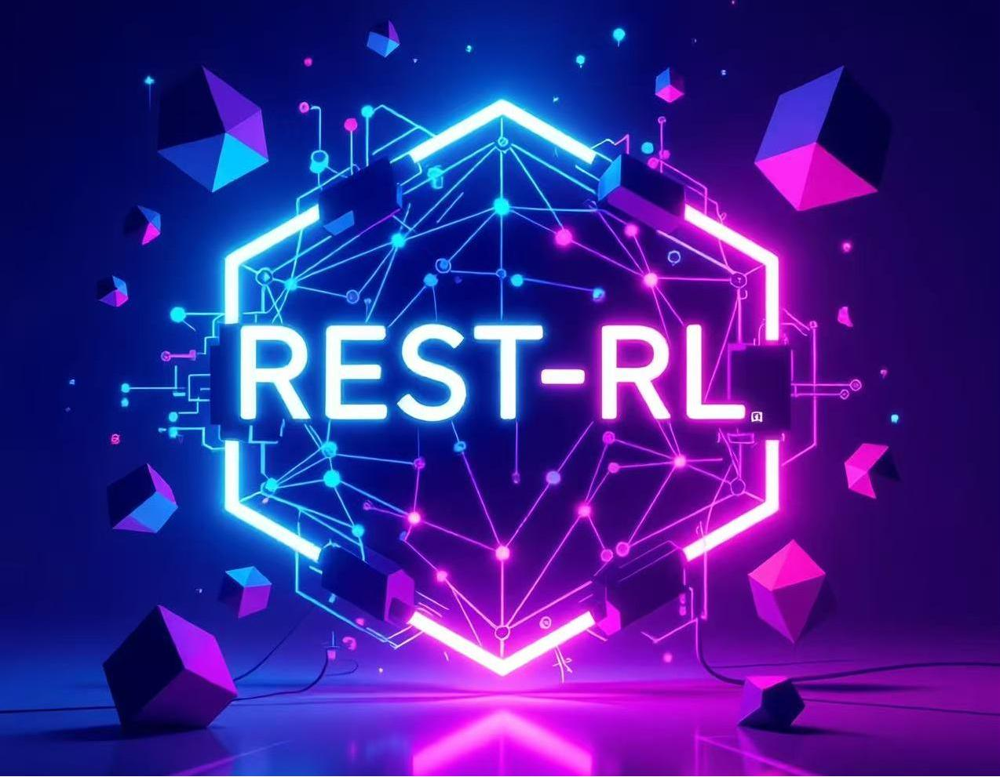
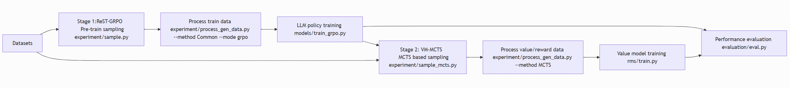

## ReST-RL: Two-Stage Reinforcement Learning for LLMs

<p align="center">
  
</p>

### Overview
ReST-RL implements a two-stage reinforcement learning pipeline for large language models (LLMs):
- **Stage 1 — Self-Training (Policy Improvement via ReST-GRPO)**: Sample on program synthesis datasets, process the generated completions into compatible data, and train the policy with a optimized group-relative policy optimization routine.
- **Stage 2 — Value Model Training and Assisted Decoding with VM-MCTS**: Collect reward signals with **MCTS**-based sampling, process them into reward data, and train a **Value Model** (default implementation: `transformers_scalar`).

Finally, the trained policy and value model are evaluated on held-out tasks.

<p align="center">
  
</p>

### Key Features
- **Unified interfaces** for sampling, processing, training, and evaluation
- **Multiple datasets**: BigCodeBench, DS1000, APPS and more
- **vLLM** support for efficient generation and tensor-parallel inference
- **ReST-GRPO** for self-training, enabling high-signal reward data collection
- **Transformer-based reward models** trained with DeepSpeed, support for transformers

### Repository Structure (selected)
- `experiment/sample.py`: Common sampling for Stage 1
- `experiment/process_gen_data.py`: Process generated data for GRPO/DPO/SFT or MCTS rewards
- `models/train_grpo.py`: GRPO training entrypoint for policy
- `models/run_grpo.sh`: Example command for GRPO training
- `experiment/sample_mcts.py`: MCTS sampling for Stage 2
- `rms/train.py`: Value(Reward) model training
- `rms/train.sh`: Example command for value model training
- `evaluation/eval.py`: Unified evaluation for LLM policy/value model assisted LLM

### Environment Setup
- Python packages are listed in `requirements.txt`.
- Recommended: CUDA-enabled environment for local vLLM and model training.

```bash
# From repository root
python -m venv .venv && source .venv/bin/activate
pip install -r requirements.txt
```

If you plan to use local model inference instead of API, ensure GPUs are available. When `--use_api` is omitted, scripts assume local inference and will configure vLLM across available CUDA devices.

### Datasets
Prepare datasets under `data/` following the expected file names used by readers:
- BigCodeBench: `data/BigCodeBench/data.json`
- DS1000: `data/DS1000/data.jsonl`
- APPS: `data/APPS/data_with_test.jsonl` for training and `data/APPS/test_500.jsonl` for evaluation

**Note**: The original data files have been compressed into `datafiles.zip` in the repository root. To use the datasets, please extract the zip file.

You can also override paths with `--directory` and `--file` in the sampling/evaluation scripts, or add your own source dataset for training.

## Stage 1: Self-Training (ReST-GRPO)

### 1.1 Sampling on datasets
Generates multiple completions per problem with on-the-fly verification.

```bash
# Example: sample on BigCodeBench with a local model (vLLM)
python -m experiment.sample \
  --domain BigCodeBench \
  --backend Qwen/Qwen2.5-Coder-7B-Instruct \
  --n 5 \
  --temperature 0.7 \
  --max_tokens 1024

# Switch dataset
# --domain DS1000   or   --domain APPS
# Optional: --directory /abs/path/to/data --file data.jsonl
# Optional: --idx_list 0 1 2 3 (use subset)
# Use API instead of local model: add --use_api and set --backend accordingly
```

Outputs are written to:
- `generate/Common/{BigCodeBench|DS1000|APPS}/{backend}/temp_{temperature}_tokens_{max_tokens}_completions.jsonl`

### 1.2 Process and assemble samples for GRPO
Converts sampling outputs into GRPO-ready train files. Modes:
- `--mode grpo`
- Optional sub-sampling via `--n_sample` and exponential decay `--alpha`

```bash
# Aggregate across datasets and build GRPO data
python -m experiment.process_gen_data \
  --domain code \
  --method Common \
  --mode grpo \
  --backend Qwen/Qwen2.5-Coder-7B-Instruct \
  --temperature 0.7 \
  --max_tokens 1024 \
  --std_accept_threshold_grpo 0.05 \
  --completion_accept_threshold_grpo 0.9 \
  --n_sample 0.5 \
  --alpha 0.95 \
  --do_aggregate

# GRPO data will be saved under
#   generate/Common/{Domain}/{backend}/temp_*_grpo_data_*.jsonl
# and when aggregated under
#   generate/Common/All/{backend}/temp_*_grpo_data_*.jsonl
```

### 1.3 Train policy with GRPO
Use Accelerate and optional DeepSpeed, following `models/run_grpo.sh`.

```bash
# Example (mirrors models/run_grpo.sh)
accelerate launch models/train_grpo.py \
  "Qwen/Qwen2.5-Coder-7B-Instruct" \
  "models/ckpts/grpo/Qwen2.5-Coder-7B-Instruct/1" \
  "generate/Common/All/Qwen--Qwen2.5-Coder-7B-Instruct/temp_0.7_tokens_1024_grpo_data_0.05_0.9_0.5_0.95.jsonl" \
  --max_prompt_length 1024 \
  --max_completion_length 1024 \
  --num_generations 8 \
  --log_completions \
  --deepspeed_config config/zero2_config.json \
  --lr 1e-7 \
  --epochs 1 \
  --save_steps 0.5 \
  --batch_size_per_device 2 \
  --gradient_accumulation_steps 1 \
  --symbol_reward 1e-3 \
  --trailing_penalty 1e-6 \
  --report_to wandb
```

Checkpoints will be saved to `save_dir`, e.g. `models/ckpts/grpo/Qwen2.5-Coder-7B-Instruct/1`.

## Stage 2: Value Model Training and Assisted Decoding

### 2.1 MCTS-based sampling
Searches the code space with MCTS and collects both terminal and intermediate rewards.

```bash
python -m experiment.sample_mcts \
  --domain APPS \
  --backend Qwen/Qwen2.5-Coder-7B-Instruct \
  --iteration_limit 100 \
  --num_sample 5 \
  --num_decision 5 \
  --exploration_constant 0.2 \
  --eps 0.1 \
  --temperature 0.7 \
  --max_tokens 1024

# Outputs under
#   generate/MCTS/{Domain}/{backend}/time_*_iter_*_sample_*_..._tokens_*_thought_{yes|no}.jsonl
```

### 2.2 Process MCTS rewards
Transforms MCTS traces into reward supervision files.

```bash
python -m experiment.process_gen_data \
  --domain code \
  --method MCTS \
  --backend Qwen/Qwen2.5-Coder-7B-Instruct \
  --temperature 0.7 \
  --max_tokens 1024 \
  --do_aggregate

# Reward files written per-domain and (optionally) aggregated under
#   generate/MCTS/All/{backend}/*_rewards.jsonl
```

### 2.3 Train the value model
Default class is `transformers_scalar` with the `deepspeed` training paradigm.

```bash
# Example (mirrors rms/train.sh)
deepspeed rms/train.py \
  Qwen/Qwen2.5-Coder-7B-Instruct \
  rms/ckpts/Qwen2.5-Coder-7B-Instruct/1 \
  generate/MCTS/All/Qwen--Qwen2.5-Coder-7B-Instruct/time_None_iter_100_sample_5_decision_3_exp_0.2_eps_0.1_temp_0.7_tokens_1024_thought_no_domains_BigCodeBench_DS1000_APPS_rewards.jsonl \
  transformers_scalar \
  --max_length 2048 \
  --deepspeed_config rms/config/zero3_config.json \
  --lr 1e-7 \
  --epochs 2 \
  --save_steps 0.5 \
  --batch_size_per_device 1
```

Adjust `--rm_class` to `standard_scalar` or `transformers_prob` as needed, but note the supported implementations in `rms/train.py` (you may also implement some rms by yourself). We recommend simply using `transformers_scalar`.

## Evaluation
Evaluate the trained policy (optionally with a value/reward model) on APPS.

```bash
# Common evaluation without reward model
after_policy_backend="ckpts/grpo/Qwen2.5-Coder-7B-Instruct/1" # or a HF model id
python -m evaluation.eval \
  --method Common \
  --domain APPS \
  --backend ${after_policy_backend} \
  --file test_500.jsonl \
  --n 1 \
  --num_sample 5 \
  --temperature 0.7 \
  --max_tokens 1024

# Common evaluation with other reward models
python -m evaluation.eval \
  --method Common \
  --domain APPS \
  --backend ${after_policy_backend} \
  --rm_backend Skywork/Skywork-Reward-Llama-3.1-8B-v0.2 \
  --rm_class skywork \
  --rm_type orm \
  --max_length 2048 \
  --file test_500.jsonl \
  --n 1 \
  --num_sample 5 \
  --temperature 0.7 \
  --max_tokens 1024

# VM-MCTS assisted decoding (requires value model)
python -m evaluation.eval \
  --method MCTS \
  --domain APPS \
  --backend ${after_policy_backend} \
  --rm_backend ckpts/rm/Qwen2.5-Coder-7B-Instruct/1 \
  --rm_class transformers_scalar \
  --rm_type prm \
  --max_length 2048 \
  --iteration_limit 15 \
  --num_decision 5 \
  --exploration_constant 0.1 \
  --eps 0.1 \
  --n 1 \
  --num_sample 5 \
  --temperature 0.7 \
  --max_tokens 1024
```

Evaluation writes to `output/apps_results/{Common|MCTS}/{backend}/`:
- `*_completions.jsonl`, `*_verified.jsonl`, and `*_results.jsonl` (final metrics)

### Practical Notes
- **GPU allocation**: Scripts automatically detect CUDA. For common evaluation with RM or for MCTS, at least 2 GPUs are required (policy and RM on separate devices). See logic in `evaluation/eval.py` for vLLM tensor-parallel sizing.
- **API vs local**: Add `--use_api` to call remote backends; otherwise vLLM is used locally with `--vllm_tensor_parallel_size` and `--vllm_gpu_memory_utilization`.
- **Formatting and stops**: If your tokenizer lacks a chat template, the code logs a warning. Stop strings may be dataset-dependent and auto-filled by `prompts/stops.get_stop_strings`.

### Citation
If you use this repository in your research, please cite this project. A formal BibTeX entry can be added here upon publication.
```
@article{zhoubian2025rest,
  title={ReST-RL: Achieving Accurate Code Reasoning of LLMs with Optimized Self-Training and Decoding},
  author={Zhoubian, Sining and Zhang, Dan and Dong, Yuxiao and Tang, Jie},
  journal={arXiv preprint arXiv:2508.19576},
  year={2025}
}
```
### Acknowledgements
- Zhipu AI 
- BigCodeBench, DS1000, APPS datasets
- Evalplus for benchmark evaluation
- Hugging Face Transformers and Accelerate
- DeepSpeed and vLLM 
